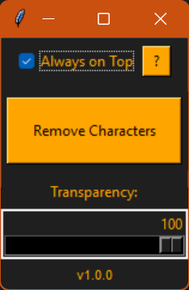

# 🧼 PromptCleaner

**Version:** 1.0.0  
**Date:** 2025-03-31

---

## 🧾 Description

**PromptCleaner** is a lightweight GUI tool for cleaning up overloaded prompts used in AI image generation – especially when those prompts include excessive **weightings** like `(term:1.2)` or nested parentheses.

The tool helps reset a prompt to a clean and neutral state by:

- Removing all parentheses `(` `)`
- Removing numbers, dots and colons associated with weightings (e.g., `:1.2`, `1.0)`)
- Simplifying complex or hard-to-read prompt structures

## 🖼️ Preview

Here’s a preview of the PromptCleaner GUI:




Ideal for creators who want to quickly simplify prompts before using them in a generator.

---

## ✅ Supported AI Generators

PromptCleaner is compatible with any system that uses parentheses and weighting in prompts, including:

- **Stable Diffusion** (Automatic1111, ComfyUI)
- **InvokeAI**
- **Mage.space**
- **NightCafe**
- **Playground AI**
- **Leonardo AI**
- **RunDiffusion**
- **Dreamlike.art**
- ...and others that support `(term:1.2)` syntax

---

## 🔧 Installation and Execution

1. Make sure Python 3.10 or later is installed: https://www.python.org  
2. Download this repository or clone it using Git.  
3. Open a terminal (e.g., PowerShell) inside the `PromptCleaner` folder.  
4. Install the required packages:

   ```bash
   pip install -r requirements.txt

Start the application:

   ```bash
python PromptCleaner.py

🖥️ Features
Removes all round parentheses from prompts

Cleans weightings like :1.0 or 1.2) from prompt text

Clipboard integration: cleans text directly from clipboard

"Always on Top" toggle

Adjustable window transparency via slider

Draggable GUI window

Minimal and user-friendly design

📄 License
This project is licensed under the
Creative Commons Attribution-NonCommercial 4.0 International (CC BY-NC 4.0) license.
See the file LICENSE.md for full details.

